<p align="center"><b>МОНУ НТУУ КПІ ім. Ігоря Сікорського ФПМ СПіСКС</b></p>
<p align="center">
<b>Звіт до Розрахунково-графічної роботи</b><br/>
дисципліни "Вступ до функціонального програмування"
</p>

<p align="right"> 
<b>Студент</b>: 
<em> Оваденко Владислава КВ-21</em></p>

<p align="right"><b>Рік</b>: <em>2025</em></p>

## Загальне завдання

1. Реалізувати програму для обчислення функції згідно варіанту мовою Common Lisp.  
   Варіант обирається згідно списку варіантів для лабораторних робіт за модулем 16:
   1 -> 1, 2 -> 2, ..., 17 -> 1, 18 -> 2 і т.д.
2. Виконати тестування реалізованої програми.
3. Порівняти результати роботи програми мовою Common Lisp с розрахунками
   іншими засобами.

## Постановка задачі конкретного варіанту

<p align="center">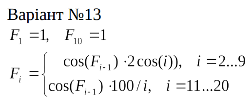</p>

## Реалізація програми мовою Common Lisp (текст програми)
   
   ```lisp  
   (defun calc-f (i)
      (cond
         ((= i 1) 1.0)
         ((= i 10) 1.0)
            
         ; i = 2..9: F(і) = cos(F(і-1)) * 2*cos(i)
         ((and (>= i 2) (<= i 9))
         (* (cos (calc-f (- i 1)))
            (* 2 (cos i))))

         ; i = 11..20: F(і) = cos(F(і-1)) * 100 / i
         ((and (>= i 11) (<= i 20))
         (* (cos (calc-f (- i 1)))
            (/ 100 i)))
            
         (t (format t "Undefinded"))))
   ```
## Реалізація тестових утиліт і тестових наборів (текст програми)
   
   ```lisp
   ;Функція перевірки коректності обрахунку F(i)
   (defun check-calc-f (name input expected)
         (let ((result (calc-f input))
               (tolerance 0.1))
            (format t "~:[FAILED~;PASSED~]... ~a: Expected ~a, Got ~5$~%"
                     (< (abs (- result expected)) tolerance)
                     name
                     expected
                     result)))

;Тестові набори
   (defun test-calc-f ()
      (format t "Running tests:~%")
      
      ;Позитивні тести
      (format t "True tests~%")
      (check-calc-f "Test 1 i=1" 1 1)
      
      (check-calc-f "Test 2 i=2" 2 -0.44969)

      (check-calc-f "Test 3 i=9" 9 -1.7465)
      
      (check-calc-f "Test 4 i=10" 10 1.0)
      
      (check-calc-f "Test 5 i=11" 11 4.91184)

      (check-calc-f "Test 7 i=20" 20 -2.81803)              

      ;Негативні тести
      (format t "~%False tests~%")
      (format t "Test 8 i=0 : Expected Undefinded, Got ")
      (calc-f 0)
      (format t "~%Test 9 i=21: Expected Undefinded, Got ")
      (calc-f 21))
   ```
## Результати тестування програми
   
   ```lisp
   CL-USER> (test-calc-f)
      Running tests:
      True tests
      PASSED... Test 1 i=1: Expected 1, Got 1.00000
      PASSED... Test 2 i=2: Expected -0.44969, Got -0.44969
      PASSED... Test 3 i=9: Expected -1.7465, Got -1.74650
      PASSED... Test 4 i=10: Expected 1.0, Got 1.00000
      PASSED... Test 5 i=11: Expected 4.91184, Got 4.91184
      PASSED... Test 7 i=20: Expected -2.81803, Got -2.79284

      False tests
      Test 8 i=0 : Expected Undefinded, Got Undefinded
      Test 9 i=21: Expected Undefinded, Got Undefinded
      NIL
   ```
## Порівняння результатів з обчисленням іншими програмними засобами або за допомогою калькулятора
   
   Обрахунки для і=2..9, 11...20:
   1. <b>i=2</b>  
      Вигляд виразу:   
      cos(1) * 2*cos(2)  
      Результат обрахунку:
      
      <p align="center">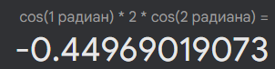</p>

   2. <b>i=3</b>   
      Вигляд виразу:  
      cos(cos(1)*2*cos(2)) * 2*cos(3)  
      Результат обрахунку:
      <p align="center">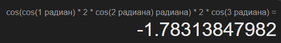</p>

   3. <b>i=4</b>   
      Вигляд виразу:   
      cos(cos(cos(1)*2*cos(2))*2*cos(3)) * 2*cos(4)  
      Результат обрахунку:
      <p align="center">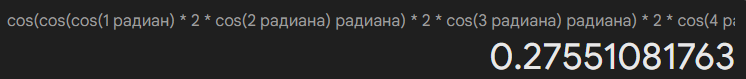</p>

   4. <b>i=5</b>   
      Вигляд виразу:  
      cos(cos(cos(cos(1)*2*cos(2))*2*cos(3))*2*cos(4)) * 2*cos(5)  
      Результат обрахунку:
      <p align="center">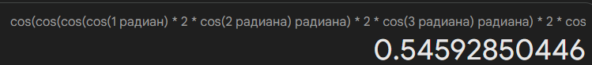</p>

   5. <b>i=6</b>   
      Вигляд виразу:   
      cos(cos(cos(cos(cos(1)*2*cos(2))*2*cos(3))*2*cos(4))*2*cos(5)) * 2*cos(6)  
      Результат обрахунку:
      <p align="center">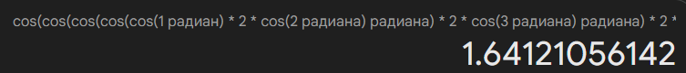</p>

   6. <b>i=7</b>   
      Вигляд виразу:  
      cos(cos(cos(cos(cos(cos(1)*2*cos(2))*2*cos(3))*2*cos(4))*2*cos(5))*2*cos(6)) * 2*cos(7)  
      Результат обрахунку:
      <p align="center">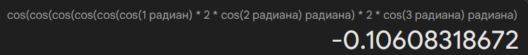</p>

   7. <b>i=8</b>   
      Вигляд виразу:  
      cos(cos(cos(cos(cos(cos(cos(1)*2*cos(2))*2*cos(3))*2*cos(4))*2*cos(5))*2*cos(6))*2*cos(7)) * 2*cos(8)  
      Результат обрахунку:
      <p align="center">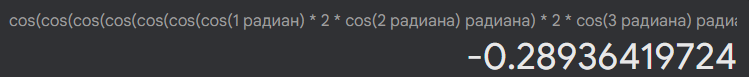</p>

   8. <b>i=9</b>   
      Вигляд виразу:   
      cos(cos(cos(cos(cos(cos(cos(cos(1)*2*cos(2))*2*cos(3))*2*cos(4))*2*cos(5))*2*cos(6))*2*cos(7))*2*cos(8)) * 2*cos(9)  
      Результат обрахунку:
      <p align="center">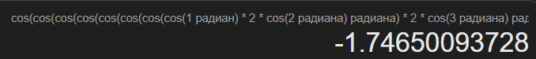</p>

   9. <b>i=11</b>   
      Вигляд виразу:     
      cos(1) * 100/11  
      Результат обрахунку:
      <p align="center">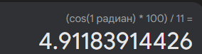</p>
      
   10. <b>i=12</b>   
      Вигляд виразу:    
      cos(cos(1)*100/11) * 100/12  
      Результат обрахунку:
       <p align="center">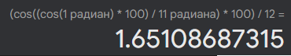</p> 
   11. <b>i=13</b>   
      Вигляд виразу:     
      cos(cos(cos(1)*100/11)*100/12) * 100/13    
      Результат обрахунку:
       <p align="center">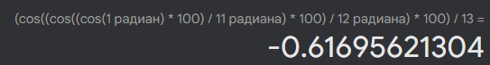</p>
   12. <b>i=14</b>   
      Вигляд виразу:   
      cos(cos(cos(cos(1)*100/11)*100/12)*100/13) * 100/14  
      Результат обрахунку:
       <p align="center">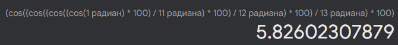</p>
   13. <b>i=15</b>     
      Вигляд виразу:   
      cos(cos(cos(cos(cos(1)*100/11)*100/12)*100/13)*100/14) * 100/15    
      Результат обрахунку:
       <p align="center">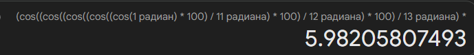</p>
   14. <b>i=16</b>   
      Вигляд виразу:   
      cos(cos(cos(cos(cos(cos(1)*100/11)*100/12)*100/13)*100/14)*100/15) * 100/16     
      Результат обрахунку:
       <p align="center">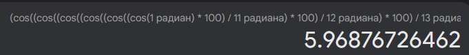</p> 
   15. <b>i=17</b>   
      Вигляд виразу:  
      cos(cos(cos(cos(cos(cos(cos(1)*100/11)*100/12)*100/13)*100/14)*100/15)*100/16) * 100/17     
      Результат обрахунку:
       <p align="center">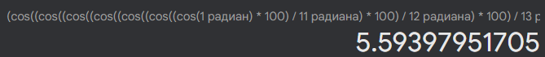</p>
   16. <b>i=18</b>   
      Вигляд виразу:   
      cos(cos(cos(cos(cos(cos(cos(cos(1)*100/11)*100/12)*100/13)*100/14)*100/15)*100/16)*100/17) * 100/18    
      Результат обрахунку:
       <p align="center">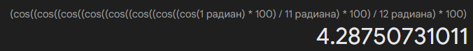</p>
   17. <b>i=19</b>   
      Вигляд виразу:   
      cos(cos(cos(cos(cos(cos(cos(cos(cos(1)*100/11)*100/12)*100/13)*100/14)*100/15)*100/16)*100/17)*100/18) * 100/19  
      Результат обрахунку:
       <p align="center">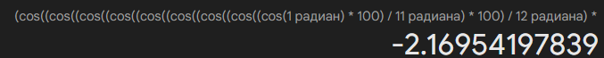</p>
   18. <b>i=20</b>   
      Вигляд виразу:   
      cos(cos(cos(cos(cos(cos(cos(cos(cos(cos(1)*100/11)*100/12)*100/13)*100/14)*100/15)*100/16)*100/17)*100/18)*100/19) * 100/20  
      Результат обрахунку:
       <p align="center">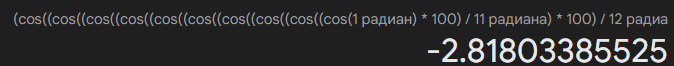</p>  
